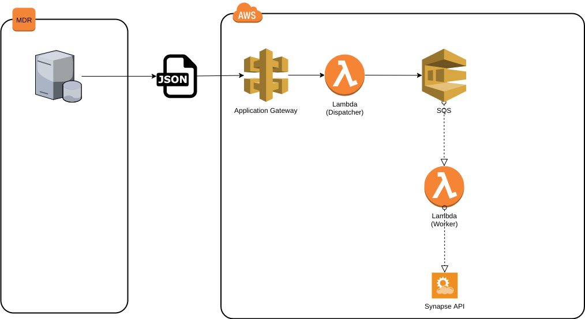

# Serverless KI Synapse Bridge

## Project Setup

- Create a virtual environment for the project. Run this from the project's root directory.
  - `python3 -m venv .venv` 
- Activate the virtual environment.
  - `source .venv/bin/activate`
- Install dependencies.
  - `pip install -r requirements.txt`
  - `pip install -r requirements-dev.txt`
- Run specs.
  - `pytest`